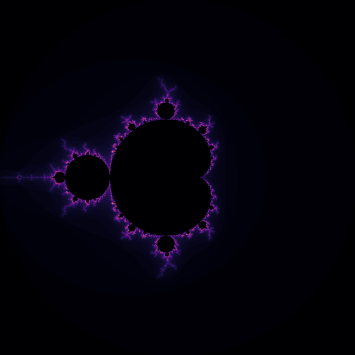

# Fractals

Plotting fractals in Python.

## Installation

```shell
poetry install --no-dev
```

## Mandelbrot

The following command will display mandelbrot set:

```shell
python -m fractals.mandelbrot
```

With 100 iterations:

```shell
python -m fractals.mandelbrot -i 100
```



### Center coordinates

You can set center coordinates using `-x` and `-y` options for set x and y center coordinates respectively.
By default center coordinates is (0, 0).

The following command will display mandelbrot set with center in (-2, 0) point:

```shell
python -m fractals.mandelbrot -x -2 -y 0
```

### Scaling

If you want to scale image use `-s`/`--scale` option.
By default scale is 1.

2x scale:

```shell
python -m fractals.mandelbrot -s 2
```

Another way to scale is set plot width (`-W`/`--width`) and height (`-H`/`--height`) options. 
Width is width of region in mandelbrot set. 
Height is height of region in mandelbrot set. 
By default width and height is 4.

The following command will display mandelbrot set on x and y axes in (-0.5, 0.5) range:

```shell
python -m fraclas.mandelbrot -W 1 -H 1
```

### Iterations:

You can set number of iterations (`-i`/`--iterations` option) for check if number in mandelbrot set. 
By default will be used 1000 iterations.

The following command will use 5000 iterations:

```shell
python -m fraclas.mandelbrot -i 5000
```

### Image resolution

You can set image resolution using image width (`-iw`/`--image-width`) and image height (`-ih`/`--image-height`) options. 
By default image width and height is 1000 px (1000x1000 px).

The following command will display mandelbrot set with image resolution 2000x2000 px:

```shell
python -m fraclas.mandelbrot -iw 2000 -ih 2000
```

### Color map

You can set color map (`-c`/`--color-map` option) - colors for display. 

The following command will display mandelbrot set with `inferno` color map:

```shell
python -m fraclas.mandelbrot -c inferno
```

By default color map is `magma`.

Available color maps: `Accent`, `Accent_r`, `Blues`, `Blues_r`, `BrBG`, `BrBG_r`, `BuGn`, `BuGn_r`, `BuPu`, `BuPu_r`, `CMRmap`, `CMRmap_r`, `Dark2`, `Dark2_r`, `GnBu`, `GnBu_r`, `Greens`, `Greens_r`, `Greys`, `Greys_r`, `OrRd`, `OrRd_r`, `Oranges`, `Oranges_r`, `PRGn`, `PRGn_r`, `Paired`, `Paired_r`, `Pastel1`, `Pastel1_r`, `Pastel2`, `Pastel2_r`, `PiYG`, `PiYG_r`, `PuBu`, `PuBuGn`, `PuBuGn_r`, `PuBu_r`, `PuOr`, `PuOr_r`, `PuRd`, `PuRd_r`, `Purples`, `Purples_r`, `RdBu`, `RdBu_r`, `RdGy`, `RdGy_r`, `RdPu`, `RdPu_r`, `RdYlBu`, `RdYlBu_r`, `RdYlGn`, `RdYlGn_r`, `Reds`, `Reds_r`, `Set1`, `Set1_r`, `Set2`, `Set2_r`, `Set3`, `Set3_r`, `Spectral`, `Spectral_r`, `Wistia`, `Wistia_r`, `YlGn`, `YlGnBu`, `YlGnBu_r`, `YlGn_r`, `YlOrBr`, `YlOrBr_r`, `YlOrRd`, `YlOrRd_r`, `afmhot`, `afmhot_r`, `autumn`, `autumn_r`, `binary`, `binary_r`, `bone`, `bone_r`, `brg`, `brg_r`, `bwr`, `bwr_r`, `cividis`, `cividis_r`, `cool`, `cool_r`, `coolwarm`, `coolwarm_r`, `copper`, `copper_r`, `cubehelix`, `cubehelix_r`, `flag`, `flag_r`, `gist_earth`, `gist_earth_r`, `gist_gray`, `gist_gray_r`, `gist_heat`, `gist_heat_r`, `gist_ncar`, `gist_ncar_r`, `gist_rainbow`, `gist_rainbow_r`, `gist_stern`, `gist_stern_r`, `gist_yarg`, `gist_yarg_r`, `gnuplot`, `gnuplot2`, `gnuplot2_r`, `gnuplot_r`, `gray`, `gray_r`, `hot`, `hot_r`, `hsv`, `hsv_r`, `inferno`, `inferno_r`, `jet`, `jet_r`, `magma`, `magma_r`, `nipy_spectral`, `nipy_spectral_r`, `ocean`, `ocean_r`, `pink`, `pink_r`, `plasma`, `plasma_r`, `prism`, `prism_r`, `rainbow`, `rainbow_r`, `seismic`, `seismic_r`, `spring`, `spring_r`, `summer`, `summer_r`, `tab10`, `tab10_r`, `tab20`, `tab20_r`, `tab20b`, `tab20b_r`, `tab20c`, `tab20c_r`, `terrain`, `terrain_r`, `turbo`, `turbo_r`, `twilight`, `twilight_r`, `twilight_shifted`, `twilight_shifted_r`, `viridis`, `viridis_r`, `winter`, `winter_r`.
